# 🌱 ESG Sentinel — Agentic ESG Intelligence & Sentiment Analysis

> An agentic RAG system that tracks ESG (Environmental, Social, Governance) health for Indian-listed companies by ingesting annual reports, news, and regulatory filings — then answers natural language queries with grounded, cited evidence.

---

## 📌 The Problem

ESG investing is growing rapidly in India, driven by SEBI's Business Responsibility and Sustainability Report (BRSR) mandate and global fund ESG screening requirements. Yet analysts and fund managers face a hard data access problem:

- **ESG reports are buried in PDFs** — annual reports, BRSR filings, sustainability disclosures — hundreds of pages per company, per year
- **News signals are unstructured** — ESG-relevant events (factory accidents, water violations, board controversies) appear in news, not filings, often months before formal disclosure
- **No unified query interface** — there is no system where you can ask "Is Tata Steel's water usage improving YoY?" and get a cited, grounded answer from both the annual report and recent news

The result: ESG analysis at scale requires a team of analysts doing manual PDF review and news monitoring — expensive, slow, and inconsistent.

---

## 💡 The Solution

**ESG Sentinel** is an agentic RAG pipeline that:

1. **Ingests** company ESG documents (annual reports, BRSR filings, sustainability reports) and indexes them into a vector store
2. **Monitors** financial news in real time and classifies each article by ESG pillar (E/S/G) and sentiment using a fine-tuned FinBERT model
3. **Answers** natural language queries by retrieving relevant chunks from both document and news indices, then synthesizing a cited response
4. **Scores** companies across ESG dimensions with trend tracking (YoY comparison)
5. **Flags** anomalies — e.g., a company reporting strong E-pillar scores in filings while negative environmental news spikes in the same period

---

## 🏗️ Architecture Overview

```
┌──────────────────────────────────────────────────────────────────────┐
│                         Data Ingestion Layer                          │
├─────────────────────────────┬────────────────────────────────────────┤
│   Document Ingestion Agent  │      News Monitoring Agent             │
│  (PDFs: annual reports,     │  (RSS feeds, financial news APIs)      │
│   BRSR filings, ESG decks)  │                                        │
└──────────────┬──────────────┴──────────────────┬───────────────────-─┘
               │                                 │
               ▼                                 ▼
┌──────────────────────────┐     ┌───────────────────────────────────┐
│  Document Chunker &      │     │  FinBERT Sentiment Classifier     │
│  Metadata Tagger         │     │  (E / S / G pillar + sentiment)   │
│  (company, year, pillar) │     └──────────────────┬────────────────┘
└──────────────┬───────────┘                        │
               │                                    │
               ▼                                    ▼
┌──────────────────────────────────────────────────────────────────────┐
│                          Vector Store (ChromaDB)                      │
│                                                                       │
│   Collection: esg_documents      Collection: esg_news                │
│   (text chunks + metadata)       (news items + pillar + sentiment)   │
└──────────────────────────────────┬───────────────────────────────────┘
                                   │
                                   ▼
┌──────────────────────────────────────────────────────────────────────┐
│                         Query & Analysis Layer                        │
├──────────────────────────┬───────────────────────────────────────────┤
│   RAG Query Agent        │   ESG Scoring Agent                      │
│   (retrieves chunks from │   (computes pillar scores,               │
│   both collections,      │    YoY trends, anomaly flags)            │
│   synthesizes response   │                                           │
│   with citations)        │                                           │
└──────────────┬───────────┴──────────────────┬────────────────────────┘
               │                              │
               ▼                              ▼
┌──────────────────────────────────────────────────────────────────────┐
│                          FastAPI Backend                              │
│          POST /query  ·  GET /score/{company}  ·  GET /alerts        │
└──────────────────────────────────────────────────────────────────────┘
               │
               ▼
┌──────────────────────────────────────────────────────────────────────┐
│                      Streamlit Dashboard                              │
│   Company ESG scores  ·  Trend charts  ·  News sentiment feed       │
│   Natural language Q&A  ·  Anomaly alerts                           │
└──────────────────────────────────────────────────────────────────────┘
```

---

## 🔄 End-to-End Workflow

```mermaid
flowchart TD
    subgraph Ingestion
        A1[Annual Report PDFs\nBRSR Filings] --> B1[Document Ingestion Agent]
        A2[Financial News\nRSS / API] --> B2[News Monitoring Agent]

        B1 --> C1[Chunk & tag by\ncompany / year / ESG pillar]
        B2 --> C2[FinBERT Classifier\nE/S/G pillar + sentiment]

        C1 --> D[(ChromaDB\nesg_documents)]
        C2 --> E[(ChromaDB\nesg_news)]
    end

    subgraph Query
        F([User Query\ne.g. 'Is Infosys\nwater usage improving?']) --> G[RAG Query Agent]
        G --> D
        G --> E
        D & E --> H[Retrieved chunks\nwith metadata + citations]
        H --> I[LLM Synthesis\nGrounded cited answer]
    end

    subgraph Scoring
        J[ESG Scoring Agent] --> D
        J --> E
        J --> K[Pillar scores\nE / S / G]
        K --> L{Anomaly\nDetection}
        L -->|Filing vs news\nmismatch| M[🚨 Alert flagged]
        L -->|Consistent| N[Score dashboard updated]
    end

    I --> O[FastAPI Response]
    M & N --> P[Streamlit Dashboard]
    O --> P

    style D fill:#fff8e8,stroke:#e67e22
    style E fill:#fff8e8,stroke:#e67e22
    style M fill:#fde8e8,stroke:#e74c3c
    style P fill:#e8f8e8,stroke:#27ae60
```



---

## 🧩 Component Breakdown

### Document Ingestion Agent
Handles PDFs of annual reports and BRSR filings. Uses PyMuPDF to extract text, chunks into ~500-token segments, and tags each chunk with:
- `company_name`, `ticker`
- `document_year`
- `esg_pillar` (E / S / G / General)
- `source_document`, `page_number`

### News Monitoring Agent
Polls financial news sources, fetches articles, and passes each through the FinBERT classifier. Stores news items with:
- `company_name`
- `esg_pillar` (E / S / G)
- `sentiment` (positive / negative / neutral)
- `sentiment_score`, `published_at`

### FinBERT Sentiment Classifier
A fine-tuned BERT model trained on financial text. Extended to classify ESG pillar alongside sentiment — mapping news to E (emissions, water, waste), S (labour, safety, diversity), or G (board, audit, executive pay).

### RAG Query Agent
On a user query:
1. Embeds the query using `sentence-transformers`
2. Retrieves top-k chunks from both `esg_documents` and `esg_news` collections
3. Passes chunks + query to the LLM for synthesis
4. Returns answer with inline citations (document/page or news source/date)

### ESG Scoring Agent
Aggregates retrieved chunks and news sentiment per company per year to produce pillar scores (0–100). Computes YoY delta and flags when filing sentiment and news sentiment diverge significantly for the same company and pillar.

---

## 🛠️ Tech Stack

| Layer | Technology |
|---|---|
| **Agent Orchestration** | LangChain / LangGraph |
| **LLM** | Claude claude-sonnet-4-6 via Anthropic API |
| **Sentiment Model** | FinBERT (fine-tuned on Indian financial news) |
| **Embeddings** | `sentence-transformers/all-MiniLM-L6-v2` |
| **Vector Store** | ChromaDB (two collections: documents + news) |
| **PDF Parsing** | PyMuPDF |
| **Backend API** | FastAPI |
| **Frontend** | Streamlit |
| **Data Processing** | Pandas, NumPy |
| **Containerization** | Docker + Docker Compose |
| **News Sources** | MoneyControl, Economic Times, NSE/BSE RSS feeds |

---

## 📂 Project Structure

```
esg-sentinel/
│
├── agents/
│   ├── document_ingestor.py      # PDF parsing, chunking, metadata tagging
│   ├── news_monitor.py           # News fetching and ingestion
│   ├── rag_query_agent.py        # Retrieval-augmented query handler
│   └── esg_scorer.py             # Pillar scoring and anomaly detection
│
├── models/
│   ├── finbert_classifier.py     # FinBERT pillar + sentiment wrapper
│   └── embeddings.py             # Sentence-transformers embedding utility
│
├── rag/
│   ├── ingest_documents.py       # Batch PDF ingestion pipeline
│   ├── ingest_news.py            # News ingestion pipeline
│   ├── retriever.py              # Unified ChromaDB retriever
│   └── vector_store/             # Persisted ChromaDB collections
│
├── api/
│   ├── main.py                   # FastAPI app
│   ├── schemas.py                # Pydantic models
│   └── routes/
│       ├── query.py              # POST /query
│       ├── scores.py             # GET /score/{company}
│       └── alerts.py             # GET /alerts
│
├── dashboard/
│   └── app.py                    # Streamlit dashboard
│
├── data/
│   ├── sample_reports/           # Sample ESG PDFs for testing
│   └── company_list.csv          # Nifty 500 company metadata
│
├── docker/
│   ├── Dockerfile
│   └── docker-compose.yml        # App + ChromaDB + Streamlit
│
├── notebooks/
│   └── finbert_eval.ipynb        # FinBERT benchmarking on Indian news
│
├── requirements.txt
└── README.md
```

---

## 🚀 Getting Started

```bash
# Clone the repository
git clone https://github.com/shreyapatro/esg-sentinel.git
cd esg-sentinel

# Start all services
docker-compose up --build

# Ingest sample ESG documents
python rag/ingest_documents.py --input data/sample_reports/

# Run the Streamlit dashboard
streamlit run dashboard/app.py

# Query via API
curl -X POST http://localhost:8000/query \
  -H "Content-Type: application/json" \
  -d '{"company": "Infosys", "question": "How has water consumption changed over the last two years?"}'
```

---

## 💬 Example Queries

```
"What is Tata Steel's carbon emission trend over the last 3 years?"
→ Retrieves E-pillar chunks from 2021, 2022, 2023 BRSR filings with cited page numbers

"Are there any recent negative news signals for Adani Ports on social issues?"
→ Retrieves S-pillar news items, classified by FinBERT, with source and date

"Compare the governance score of HDFC Bank vs ICICI Bank"
→ Scores G-pillar for both from annual report chunks, returns side-by-side

"Flag companies where ESG filings look positive but news sentiment is negative"
→ Anomaly detection agent returns ranked alert list
```

---

## 📊 ESG Scoring Framework

Each company receives scores (0–100) per pillar, aggregated from:

| Pillar | Document signals | News signals |
|---|---|---|
| **E — Environmental** | Emissions targets, water usage, waste management, energy mix | Environmental violation news, climate commitments coverage |
| **S — Social** | Employee safety metrics, diversity disclosures, community spend | Labour disputes, workplace incident coverage |
| **G — Governance** | Board independence, audit disclosures, executive compensation | Fraud allegations, regulatory action, board controversy |

Anomaly flag: triggered when filing pillar sentiment and news pillar sentiment diverge by more than a set threshold — indicating potential disclosure-reality gaps.

---

## 🔑 Key Design Decisions

**Two separate vector collections.** Documents and news have fundamentally different retrieval semantics — a BRSR chunk should not compete with a news headline in the same retrieval pool. Separate collections let the RAG agent retrieve from each deliberately and merge at the synthesis stage.

**FinBERT over general sentiment models.** General-purpose sentiment models misread financial text ("the company cut costs aggressively" is positive in finance, not negative). FinBERT is trained on financial language and extended here for ESG pillar classification on Indian market news.

**Metadata-first chunking.** Every chunk carries `company`, `year`, and `pillar` tags so retrieval can be filtered before vector similarity is even computed — faster and more precise than relying on semantic search alone.

**LLM synthesis with citation enforcement.** The query agent prompt requires the model to cite its sources (document name + page, or news headline + date) for every factual claim in the answer. Responses without citations are rejected and retried.

---

## 🗺️ Roadmap

- [ ] Document ingestion pipeline (PyMuPDF + ChromaDB)
- [ ] FinBERT ESG pillar classifier
- [ ] News monitoring agent
- [ ] RAG query agent with citation enforcement
- [ ] FastAPI backend
- [ ] ESG scoring + anomaly detection agent
- [ ] Streamlit dashboard
- [ ] Docker Compose multi-service setup
- [ ] BRSR field extraction (structured metrics from regulated filings)
- [ ] Nifty 500 full coverage
- [ ] Alert email/Slack notifications

---

## 👩‍💻 Author

**Shreya Patro** · B.Tech Computer Science (Minor: Financial Economics) · KIIT University  
[GitHub](https://github.com/shreyapatro) · [LinkedIn](https://linkedin.com/in/shreya-patro)

---

> *This project extends prior work on FinBERT benchmarking for Indian financial news sentiment analysis and builds on a Nifty 500 financial data pipeline covering revenue and profit signals for ~450 companies.*
